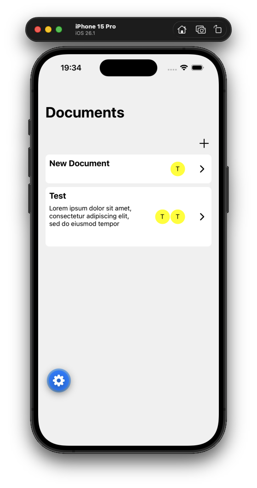
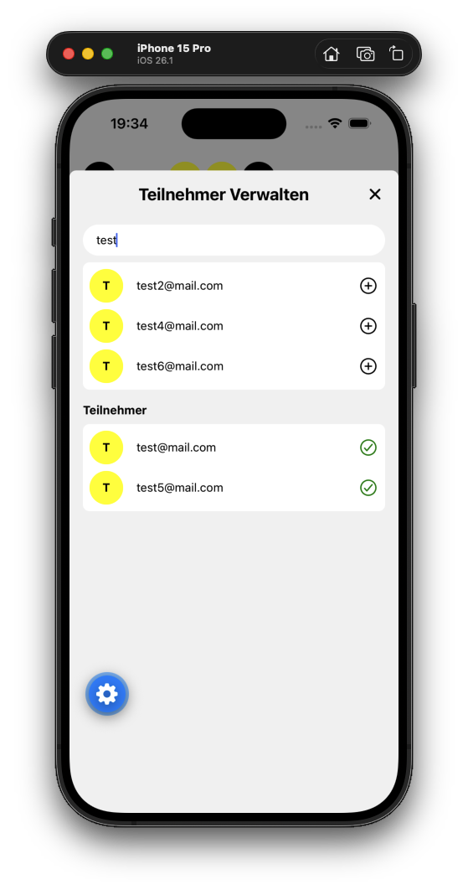

# About This Project

This project implements a shared notes mobile app that works across both Android and iOS.

The main goal was to gain experience with Node.js while also experimenting with Kubernetes and CI/CD workflows.

One of the most interesting aspects of the project is its support for feature branch deployments. Whenever a developer creates or pushes to a feature branch, GitHub Actions automatically build a Docker image and deploy it to the Kubernetes cluster with its own dedicated subdomain.
Each branch therefore runs in its own isolated environment, independently of the dev environment and other feature branches.

# Architecture

Backend: NodeJS, Drizzle ORM, PostgreSQL
Frontend: React Native
Orchestration: Kubernetes, Docker

# Screenshots

  
  

